Alguns detalhes que o diagrama deixa explícitos:

Cada lane tem duas camadas internas. A primeira (MAD + JS) são as métricas primárias de divergência e rodam sempre. A segunda (Z-Score, χ²) são diagnóstico/referência — também rodam sempre, mas a interpretação delas só é acionada quando a primeira camada sinalizou algo. Na prática isso significa: se MAD e JS estão conformes, o Z-Score vai estar baixo também, mas você ainda registra o valor no dataclass.

A lane do último dígito não tem segunda camada porque o χ² uniforme já é a métrica final — não há nada mais granular para extrair após ele.

O dataclass único de saída é o contrato entre M2 e M4: cada métrica entrega `{ valor, p_valor, flag }` independentemente de qual lane originou.